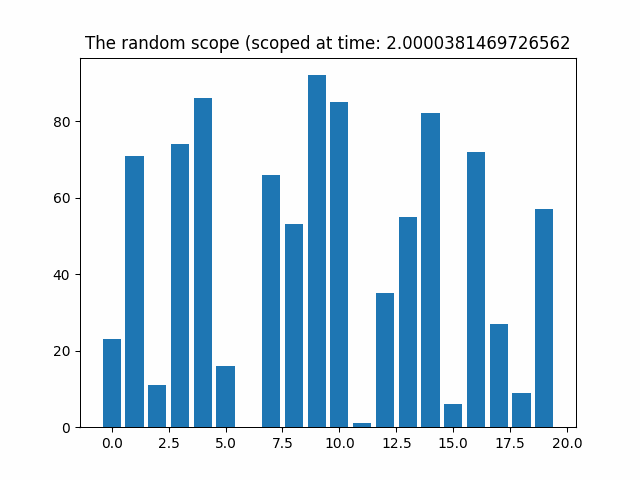

# The-Random-Scope
A tool to visualize the distributional space between randomly generated numbers dependent upon time (and random generation)

aka -> any unkown data

please see 
[random scope notebook demo](the-random-scope.ipynb)

  
^ animation created by logic from drawing below

^ very similar to the operating system loop
